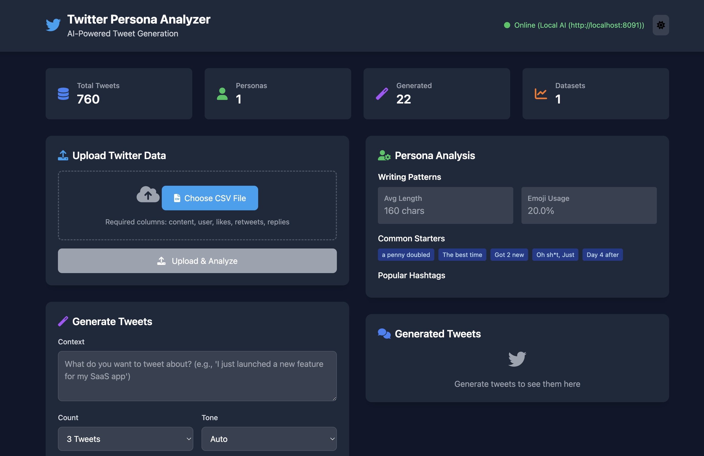
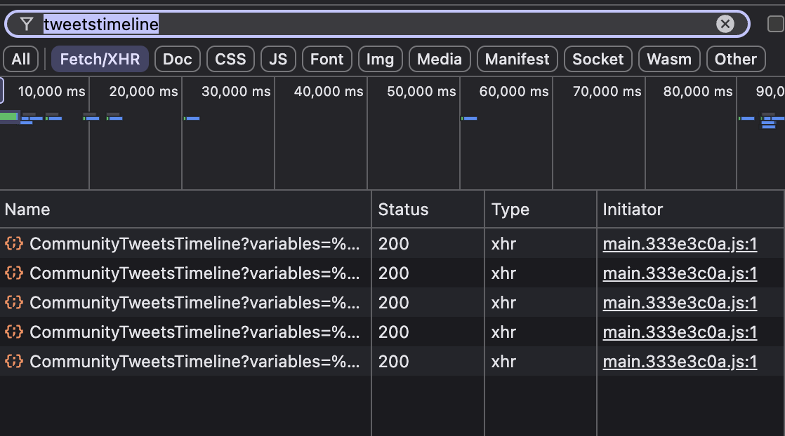

# Twitter Persona Analyzer

A full-stack web application that analyzes your Twitter community's writing patterns and generates similar tweets using AI. Perfect for content creators, marketers, and anyone wanting to maintain a consistent voice on Twitter.



## What it does

- Upload a CSV of tweets from any community or profile (check below to know how)
- Analyzes writing patterns (length, tone, hashtags, emojis)
- Identifies what content performs well
- Generates new tweets that match the successful patterns
- Beautiful web interface with dark mode support

## Quick Start

### Option 1: Docker (Recommended)

```bash
git clone https://github.com/aruntemme/twitter-analyzer.git
cd twitter-analyzer
cp .env.example .env
# Add your OpenAI API key to .env file
docker-compose up --build
```

Open http://localhost:8000 in your browser.

### Option 2: Local Setup

```bash
git clone https://github.com/aruntemme/twitter-analyzer.git
cd twitter-analyzer
pip install -r requirements.txt
cp .env.example .env
# Add your OpenAI API key to .env file
python main.py
```

## How to use

1. **Get Twitter data**: Export tweets from your target community as CSV 
    a. go to any profile or community page in twitter and scroll as much as you want
    b. open the developer tools
    c. go to the network tab
    d. search for "tweetstimeline" in the filter
    
    e. click on the request and copy the response object
    f. save those as json file under any folder i.e "tweets" and add as much as json files as you want
    g. now run the following command to convert the json files to csv
    ```bash
    python extract_tweets.py tweets
    ```
    h. now you can upload the csv file to the app
2. **Upload**: Drag and drop the CSV file in the web interface
3. **Analyze**: The app will show you the writing patterns and successful content types
4. **Generate**: Enter what you want to tweet about and get AI-generated suggestions
5. **Copy & Post**: just copy and post the tweets

## CSV Format

Your CSV file should have these columns:
- `content` - The tweet text
- `user` - Username
- `likes` - Number of likes
- `retweets` - Number of retweets  
- `replies` - Number of replies

## Configuration

### OpenAI (Recommended)
```env
OPENAI_API_KEY=your_key_here
AI_MODEL=gpt-3.5-turbo
USE_LOCAL_AI=false
```

### Local AI (Free but requires setup)
```env
USE_LOCAL_AI=true
LOCAL_AI_URL=http://localhost:8091
AI_MODEL=llama3.2:latest
```

For local AI, install [Clara](https://claraverse.netlify.app/) first and install the model.

## Features

- 🌐 Beautiful web interface with dark mode
- 📊 Tweet pattern analysis and insights
- 🤖 AI-powered tweet generation
- 📱 Mobile-friendly responsive design
- 💾 SQLite database for data persistence
- 🐳 Docker support for easy deployment
- 📋 One-click copy to clipboard
- 📈 Engagement prediction

## API Endpoints

If you want to use it programmatically:

```python
import requests

# Upload CSV
with open('tweets.csv', 'rb') as f:
    requests.post('http://localhost:8000/upload-csv', files={'file': f})

# Generate tweets
response = requests.post('http://localhost:8000/generate-tweets', json={
    "context": "I just launched my new app",
    "count": 3,
    "tone": "excited"
})
```

## Perfect for

- **Build in Public** creators maintaining consistent voice
- **Content marketers** studying successful patterns
- **Social media managers** scaling content creation
- **Anyone** wanting to improve their Twitter engagement

## Requirements

- Python 3.8+
- OpenAI API key (or local AI setup)
- tweets in your CSV

## Contributing

Pull requests welcome! This is an open-source project and I'd love your help making it better.

## License

MIT License - feel free to use this for personal or commercial projects.

---

**Questions?** Open an issue or reach out on Twitter [@aruntemme]